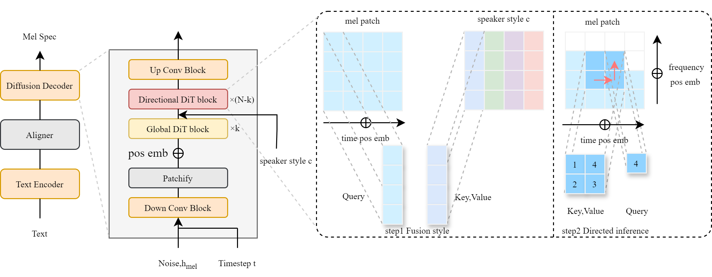

# DPI-TTS: Directional Patch Interaction for Fast-Converging and Style Temporal Modeling in Text-to-Speech

🙏 Our demo is available here. [demo site](https://7xin.github.io/DPI-TTS/). 🙏

*DPI-TTS* is DiT-based TTS model. The overall architecture of *DPI-TTS* is as below:

	

<!-- ## Shortcuts

You can find codes, a demo site, and paper links below.

**[[👉 Demo](https://dextts.github.io/demo.github.io/)]** &nbsp;&nbsp;&nbsp;&nbsp;
**[[📄 Paper](https://arxiv.org/abs/2406.19135)]** &nbsp;&nbsp;&nbsp;&nbsp;
**[[💻 DEX-TTS Code](https://github.com/winddori2002/DEX-TTS/tree/main/DEX-TTS)]** &nbsp;&nbsp;&nbsp;&nbsp;
**[[💻 GeDEX-TTS Code](https://github.com/winddori2002/DEX-TTS/tree/main/GeDEX-TTS)]** &nbsp;&nbsp;&nbsp;&nbsp; -->

## License

> Thanks to the open source codebases such as [Dex-TTS](https://github.com/winddori2002/DEX-TTS), [Inf-DiT](https://github.com/THUDM/Inf-DiT). This repository is built on them.
